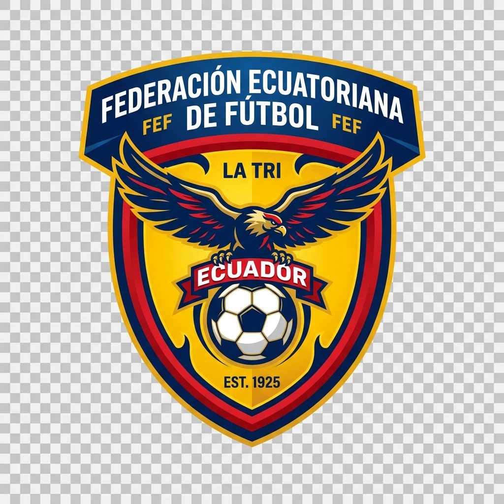

# MiTri 🇪🇨⚽
### *La Aplicación Móvil Oficial Tributo a la Selección Ecuatoriana de Fútbol*



[](https://reactnative.dev/)
[](https://expo.dev/)
[](https://www.typescriptlang.org/)
[](LICENSE)

---

## 📌 Descripción General

**MiTri** es una aplicación móvil desarrollada en **React Native** con **Expo Go**, diseñada para los hinchas de la **Selección Ecuatoriana de Fútbol ("La Tri")**. 

El aplicativo funciona como una enciclopedia interactiva y moderna que rige la trayectoria histórica de Ecuador en las Copas Mundiales de la FIFA (2002, 2006, 2014, 2022 y 2026), ofreciendo estadísticas en tiempo real, récords de leyendas, plantilla de estrellas actuales y detalles de cada partido disputado.

---

## ✨ Características Principal de la Aplicación

### 1. 🟡 Pantalla de Bienvenida (Splash Screen Interactivo)
- **Fase 1 (Splash Nativo):** Pantalla de carga nativa del sistema operativo con el escudo oficial sobre fondo amarillo tricolor (`#FFD100`).
- **Fase 2 (Secuencia Interactiva):** Pantalla de bienvenida animada con el escudo oficial de La Tri, el eslogan *"La Sele de Todos"* y un botón de ingreso con transición suave al menú principal.

### 2. 🏆 Historial de Copas del Mundo (Mundiales 2002 - 2026)
- **Corea-Japón 2002:** Primera clasificación histórica y primera victoria mundialista (1-0 vs Croacia).
- **Alemania 2006:** Histórico pase a Octavos de Final.
- **Brasil 2014:** Doblete de Enner Valencia y empate heroico ante Francia en el Maracaná.
- **Catar 2022:** Triunfo histórico en el partido inaugural del torneo.
- **Canadá / EE.UU. / México 2026:** Ficha informativa del camino rumbo a la 5ta Copa del Mundo.

### 3. 🔍 Modales de Detalle por Mundial
- Toca cualquier tarjeta mundialista para desplegar una ventana modal con:
  - Director Técnico al mando.
  - Resultado global obtenido.
  - Hito histórico de la edición.
  - Goleadores ecuatorianos.
  - Lista de partidos disputados con sus respectivos marcadores.

### 4. ⭐ Récords y Leyendas Históricas
- Tarjetas con estadísticas emblemáticas de los máximos referentes:
  - **Enner Valencia:** Máximo goleador histórico (44+ goles) y goleador en Mundiales (6 goles).
  - **Iván Hurtado:** Jugador con más internacionalidades (168 partidos).
  - **Agustín Delgado:** Autor del primer gol ecuatoriano en una Copa del Mundo.
- Ficha técnica institucional (Fundación FEF 1925, Estadio Rodrigo Paz Delgado / Olímpico Atahualpa).

### 5. ⚽ Jugadores Referentes Actuales
- Listado de la Generación Dorada de La Tri con su número de dorsal, posición y club internacional (Moisés Caicedo, Piero Hincapié, Enner Valencia, Willian Pacho, Kendry Páez).

### 6. 🎨 Simbolismo y Tema Tricolor
- Sistema de diseño dinámico basado en los colores oficiales:
  - **Amarillo Tricolor (`#FFD100`):** La riqueza de la tierra y la pasión de la hinchada.
  - **Azul Marino (`#002B49`):** El Océano Pacífico y la firmeza del equipo.
  - **Rojo Accent (`#CE1126`):** La garra y el coraje en la cancha.

---

## 🛠️ Stack Tecnológico

| Tecnología | Descripción |
| :--- | :--- |
| **React Native** | Framework base para el desarrollo móvil multiplataforma (iOS & Android). |
| **Expo SDK 54** | Ecosistema de desarrollo con soporte para *New Architecture*. |
| **Expo Router v6** | Sistema de navegación basado en archivos dentro del directorio `app/`. |
| **TypeScript** | Tipado estático estricto para garantizar un código libre de errores de ejecución. |
| **Expo Image** | Carga y renderizado optimizado de imágenes vectoriales y recursos visuales. |
| **StyleSheet API** | Gestión de estilos optimizados y temas globales en `constants/theme.ts`. |

---

## 🏗️ Arquitectura y Estructura del Código

El proyecto sigue una arquitectura **modular y escalable**, separando la lógica de datos, los estilos globales y los componentes visuales:

```text
Tri/
├── app/                        # Rutas y páginas de Expo Router
│   ├── (tabs)/                 # Navegación por pestañas
│   │   ├── _layout.tsx         # Configuración del Tab Bar inferior
│   │   ├── index.tsx           # Pantalla de Inicio (Home Screen)
│   │   └── explore.tsx         # Pantalla Acerca de MiTri
│   ├── _layout.tsx             # Layout raíz y manejo de Splash Screen
│   └── modal.tsx               # Modal genérico
├── assets/                     # Recursos gráficos e imágenes
│   └── images/                 # Escudo oficial de La Tri y assets gráficos
├── components/                 # Componentes modulares reutilizables
│   ├── custom-splash-screen.tsx # Pantalla de Bienvenida animada
│   └── home/                   # Subcomponentes de la pantalla de inicio
│       ├── hero-banner.tsx     # Encabezado principal y ficha del equipo
│       ├── nav-tabs.tsx        # Selector de pestañas internas
│       ├── world-cup-card.tsx  # Tarjeta individual por Mundial
│       ├── world-cup-modal.tsx # Modal detallado por edición de la FIFA
│       ├── records-section.tsx # Grilla de récords e hitos
│       └── players-section.tsx # Listado de jugadores referentes
├── constants/
│   └── theme.ts                # Sistema de colores corporativos e íconos
├── data/
│   └── team-info.ts            # Base de datos centralizada de La Tri (TypeScript)
├── App-Planificacion.md        # Documento de análisis y plan de evolución
├── app.json                    # Configuración de Expo y Splash Screen nativo
├── package.json                # Dependencias y scripts de ejecución
└── tsconfig.json               # Configuración de TypeScript
```

---

## 🚀 Guía de Instalación y Ejecución Local

### Requisitos Previos
- Tener instalado **Node.js** (versión LTS recomendada v18 o superior).
- Tener instalado **npm** o **yarn**.
- Tener la app **Expo Go** instalada en tu dispositivo móvil ([Android en Google Play](https://play.google.com/store/apps/details?id=host.exp.exponent) / [iOS en App Store](https://apps.apple.com/app/expo-go/id982107779)).

### Pasos para Ejecutar:

1. **Clonar o descargar el repositorio:**
   ```bash
   git clone https://github.com/Leviathan-19/Tri-Go.git
   cd Tri
   ```

2. **Instalar dependencias:**
   ```bash
   npm install
   ```

3. **Iniciar el servidor de desarrollo de Expo:**
   ```bash
   npm run start
   ```
   *(O alternativamente: `npx expo start`)*

4. **Visualizar la aplicación:**
   - **En tu celular (Recomendado):** Abre la aplicación **Expo Go** y escanea el código QR que aparece en la terminal.
   - **En Navegador Web:** Presiona la tecla `w` en la terminal.
   - **En Emulador Android:** Presiona la tecla `a` en la terminal (requiere Android Studio).
   - **En Simulador iOS:** Presiona la tecla `i` en la terminal (requiere macOS y Xcode).

---

## 🧪 Verificación de Código

Para verificar la integridad del código TypeScript y asegurarse de que no existan errores de compilación:

```bash
npx tsc --noEmit
```

---

## 📦 Compilación y APK para Android

Para generar un archivo instalable APK de forma nativa utilizando Expo Application Services (EAS Build):

```bash
npx eas build -p android --profile preview
```

---

## 📄 Licencia

Este proyecto se encuentra bajo la Licencia **MIT**. Desarrollado como un tributo educativo y cultural a la **Selección Ecuatoriana de Fútbol**. 

¡**¡Sí Se Puede!! 🇪🇨⚽**
